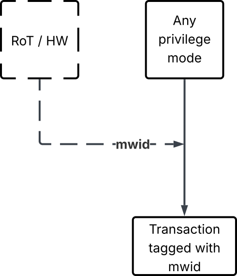
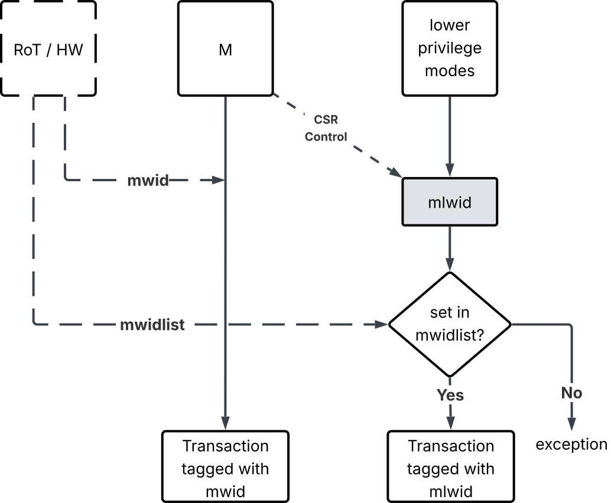
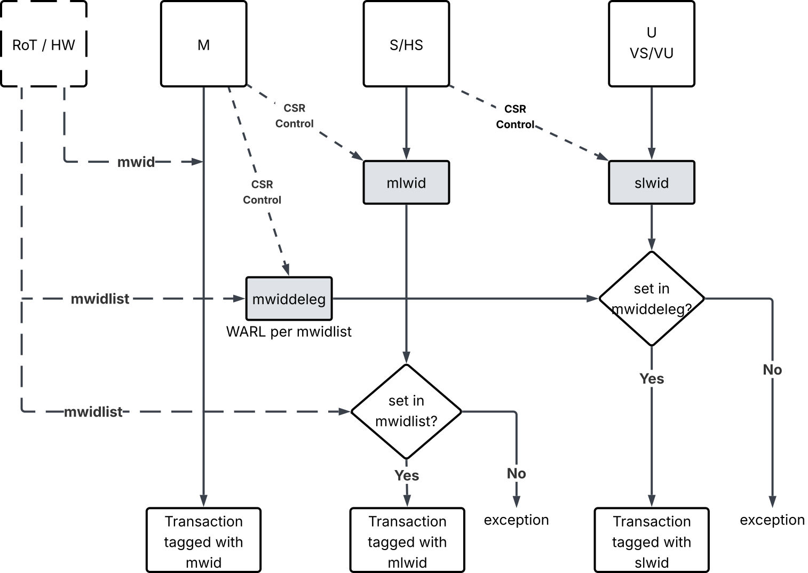

[[worlds]]

== RISC-V Worlds Overview

The _RISC-V Worlds_ provides isolation in a hardware platform by
constraining access to system physical addresses.  It provides
_Worlds_ , which are execution contexts that include agents (such as
harts and devices) that can initiate a transaction on a physical
address within a world, and resources (such as memories and peripheral
devices) that respond to transactions at a physical address within a
world.  Worlds are created and configured by a trusted execution
environment, usually at system boot time.

Worlds are uniquely identified by a hardware _World_ _Identifier_
(_WID_) and the maximum number of unique WIDs on a platform is
_NWorlds_.  Increasing NWorlds increases the hardware cost, and in
practice, 2-8 WIDs (requiring 1-3 bits to represent) are sufficient
for many use cases.

Hardware agents (harts and devices) that can initiate transactions on
physical addresses may support multiple contexts, with each context
potentially being in a different world.  A software context running on
a hart agent is present in one world at a time.  A hardware context on
a device agent is present in one world at a time.

Resources are identified by system physical addresses.  A world may be
granted read, write, or both, access permissions on a physical
address.  A resource can optionally be shared between worlds, with
independent access permissions for each world.

The _RISC-V Worlds_ is designed for the case where the allocation of
agent contexts and resources to worlds is performed before or at
reset/boot time, and not changed dynamically when the system is running
unless there is a system reset.  Efficiently changing worlds allocation
configurations dynamically while the system is running is not a goal of
the current specification.

When an agent context initiates a transaction to a physical address,
hardware marks the transaction with the WID of the agent context.  The
transaction is only allowed to complete successfully if the targeted
resource has the appropriate access permissions (read or write)
on that address for the WID on the transaction.  The permission checks
might be performed at the agent, at the resource, or anywhere along the
path the transaction takes through the platform’s bus hierarchy.  The bus
transaction carries the WID through the interconnect and all elements
on the path toward the targeted resource until access permissions can
be checked.  The method of propagating and checking the WID on busses
is platform-specific, with different bus fabrics supporting WIDs in
bus-specific ways. Similarly, any cache on the path that may need to
allocate data into cache lines must consider the WID of the original
transaction. The method of propagating and using the WID through caches is
platform-specific, as well as the cache policy.

NOTE: Theoretically all permissions checks on transactions could be
performed at the source agent to prevent any illegal transactions from
entering the bus fabric. But in practice, replicating and checking the
entire platform permissions map at each agent is prohibitively
expensive, particularly when permissions are configurable, and so it is
assumed that permissions checking is distributed out in the bus fabric and
attached resources.

If the permission check fails, the transaction is terminated or
modified to avoid violating world isolation and the failure may be
reported. Failures may be reported in a number of ways depending on
the platform, the agent, the resource, and the transaction type.
Failures may be reported to the initiating agent, and optionally one
or more other agents. In some cases, the failure cannot be directly
reported to the initiating agent and the transaction is modified to be
ignored or to return benign data.  In these cases, the failure may
still be reported to a different agent through an alternate mechanism.

== RISC-V ISA World-ID Extensions

RISC-V harts that support Worlds associate a WID with all memory
accesses initiated by that hart.  The World-ID extensions allow
different privilege modes on a hart to be tagged with different WIDs.

There are three levels of Worlds support on RISC-V harts.  The first level
does not require an ISA extension and fixes the WID for all privilege
modes on a hart.  The second level is the *Smwid* extension, which
enables M-mode to control the WID of lower-privilege modes.  The third
level is the *Smwdeleg* and *Smwdelegh* extensions, which further enable
M-mode to delegate to S-mode the ability to assign the WID of lower-
privilege modes, thereby adding the *Sswid* extension to S-mode.

All accesses, including implicit memory references such as instruction
fetches and page-table walks, must be tagged with the appropriate WID.

*World-ID extensions do not allow a privilege mode to change its own WID.*
The WID of M-mode on a hart (`mwid`) is set by the external environment.

NOTE: It is platform-specific whether `mwid` can change or not between resets.

NOTE: Different harts in a system may have different WIDs in M-mode.

=== RISC-V Worlds CSRs

The RISC-V Worlds Smwid, Smwdeleg, and Sswid extensions allow a hart to assign
WIDs to its privilege modes.  The new CSRs are listed in the Table below.

[cols="1,1,^1,^1,5"]
.World-ID CSRs
|===
|Size in bits|Register|Access|Proposed CSR Address|Description
| `XLEN` | `mlwid` | WARL for M | `0x390` | WID used for lower privilege modes.
`Ceil(Log~2~NWorlds)` LSBs are used, others are zero.
| `XLEN` | `mwiddeleg` (aka `mwiddeleg0`) | WARL for M | `0x748` | Set of WID
values delegated to S-mode, represented as a bit vector. `NWorlds` LSBs
are used, others are zero.
| `XLEN` | `slwid` | WARL for S | `0x190` | WID value used in lower modes
(i.e., U-mode). `Ceil(Log~2~NWorlds)` LSBs are used, others are zero.
|===

These extensions support NWorlds {le} `XLEN`.

The RISC-V Worlds Smwdelegh extension adds support for up to 128 Worlds.
When this extension is present, NWorlds {le} 128.
The additional CSRs are listed below.

[cols="1,1,^1,^1,5"]
.Smwdelegh additional CSRs
|===
|Size in bits|Register|Access|Proposed CSR Address|Description
| `XLEN` | `mwiddeleg1` | WARL for M | | Set of WID values delegated to
S-mode (WID 32 to 63), represented as a bit vector, RV32 only.
| `XLEN` | `mwiddeleg2` | WARL for M | | Set of WID values delegated to
S-mode (WID {ge} 64), represented as a bit vector.
| `XLEN` | `mwiddeleg3` | WARL for M | | Set of WID values delegated to
S-mode (WID 96 to 127), represented as a bit vector, RV32 only.
|===

=== One world per hart

In this case, there are no ISA-visible additions to the RISC-V hart.
The hart is reset into a single world and all transactions from that
hart, regardless of privilege mode, are tagged with the WID of that
world.  How the hart is assigned to a world, or whether and how a hart
is allowed to determine any information about worlds configuration is
platform-specific.

.One world per hart

NOTE: The `mwid` can be set via a pinstrap, a fuse or a RoT-controlled
register. The implementation is platform-specific.

=== Smwid extension

The Smwid extension adds support for M-mode to control the world used
by less-privileged modes, and can only be added to harts with at
least two privilege modes.

The Smwid extension adds the `mlwid` CSR, which is an M-mode read-write
CSR, whose least-significant bits set the WID to be used by
lower-privilege modes.

NOTE: If the system supports demand-paged virtual memory, then any
address-translation caches must ensure that translations are cached
separately for each WID.  A simple implementation can flush
address-translation caches on any `mlwid` write.

The `mlwid` field is WARL that can contain Ceil(Log~2~NWorlds)-1:0 writable
bits.

It is platform-specific which worlds can be used by lower-privilege modes
on this hart.

NOTE: There is no HW discovery mechanism for M-mode software to discover the
available worlds and their permissions (besides taking exceptions). Information
about worlds and resources assignment must be provided to SW via sideband
channels.  The platform software will have predetermined allocations for the
worlds on a platform and all required information needed by M-mode software
must be provided out-of-band.

A list of WID values authorized for this hart to be used by lower-privilege
modes can be provided. `mwidlist` (width of NWorlds) represents a set
of WIDs as a bit vector, with WID _i_ represented by bit _i_ of the register.

If an unauthorized WID (per the `mwidlist`) is written to `mlwid`, when the
lower-privilege mode attempts to fetch its first instruction in an illegal world,
the hart will take a precise exception indicating the software-check cause.
Similarly, after a `mpriv` update, if the lower-privilege attempts to perform a
load or store in an illegal world, the hart will take a precise exception
indicating the software-check cause.

When this exception is raised, the `xtval` register is set to 0 (no information
provided).  The software-check exception caused by illegal world has higher
priority than any access-fault exception and leads to a trap being delivered
to M-mode.

.Smwid extension: Support for M-mode to control the lower privilege modes world

M-mode may have a different WID than any assignable by `mlwid` to
lower-privilege modes.

NOTE: The platform is not required to allow lower-privilege modes to
be in the same world as M-mode. (`mwid` value may not be included in the
`mwidlist`). It is up to the platform architect to decide whether to
allow this or not.

=== Smwdeleg(h) / Sswid extensions

The Smwdeleg extension requires the Smwid extension and allows M-mode to
delegate to S-mode the ability to allocate WIDs to privilege modes
lower than S.  The Smwdeleg extension optionally enables the Sswid
extension for S-mode.

The Smwdelegh extension requires the Smwdeleg extension and extends the
set of worlds that can be delegated to S-mode to include WIDs up to
127.

The Smwdeleg extension adds the `mwiddeleg` M-mode read-write CSR.  The
`mwiddeleg` register represents a set of WIDs as a bit vector with
WID _i_ represented by bit _i_ of the register.  The `mwiddeleg` CSR
is a WARL register where each bit that can be set indicates a WID that
is delegated to S-mode.  The set of worlds that can be delegated to
S-mode on a hart is platform-specific. Legal values are defined by
`mwidlist`.

The Smwdelegh extension adds the `mwiddeleg1`, `mwiddeleg2`, and
`mwiddeleg3` M-mode read-write CSRs.

NOTE: Different harts on a platform can have different sets of
delegable worlds.

When `mwiddeleg` CSR is written, the data is ANDed with `mwidlist` to
determine the final legal value. If the result is zero, the Sswid extension
is disabled. If the result is non-zero, the Sswid extension is enabled.
Like any other WARL register, M-mode software is expected to read back the
configured value to verify it is indeed legal.

The Sswid extension adds the S-mode read-write `slwid` CSR, which
sets the WID used for modes lower than S-mode.  The `slwid` field is WARL
that can contain Ceil(Log~2~NWorlds)-1:0 writable bits. Like any other WARL
register, S-mode software is expected to read back the configured value to
verify it is indeed legal.

An unauthorized WID (per the `mwiddeleg` list) can
be written to `slwid`. In that case, when the lower-privilege mode attempts to
fetch its first instruction in an illegal world, the hart will take a precise
exception indicating the software-check cause. 
Similarly, after a `mpriv` update, if the lower-privilege attempts to perform a
load or store in an illegal world, the hart will take a precise exception
indicating the software-check cause.

When this exception is raised, the `xtval` register is set to 0 (no information
provided).  The software-check exception caused by illegal world has higher
priority than any access-fault exception and leads to a trap being delivered
to M-mode.

.Smwdeleg/Sswid extensions: Support for S-mode to control the lower privilege modes world

If the value in `mwiddeleg` is non-zero, the Sswid extension is enabled.

If the value in `mwiddeleg` is zero, then the Sswid extension is
disabled and accesses to `slwid` raise an illegal instruction
exception. `mlwid` world is assigned to S-mode and lower privilege modes.

NOTE: If the system supports demand-paged virtual memory, then any
address-translation caches must ensure that translations are cached
separately for each WID.  A simple implementation can flush
address-translation caches on any write to `mwiddeleg` or `slwid`.

//When the hypervisor extension is present `slwid` sets the WID for both
//VS and VU mode, as well as U mode.

NOTE: The Sswid extension is not available to a guest OS.

There is no requirement for `mwiddeleg` to contain the WID in `mlwid`,
i.e., S-mode can be set to a different world than the ones it is
allowed to assign to lower modes using `slwid` when Sswid is enabled.

At reset, `mwiddeleg` is set to zero and hence Sswid is disabled.

=== Response to permission violations

When a hart attempts an explicit or implicit memory access that fails
a World permissions check, the access may or may not raise an
access-fault exception of the appropriate type (i.e.,
instruction-access fault, load-access fault, or store/AMO-access
fault).  When an access-fault exception cannot be raised, the
instruction performing the memory access can be retired but any writes
to the protected physical memory location are ignored and any memory
reads return data independent of the value in the protected physical
memory location to avoid violating memory isolation.

NOTE: Secure systems will typically ensure that some agent is notified
when an illegal access is attempted, even when an access-fault
exception cannot be raised on the hart context.

NOTE: We cannot require that reads that fail permissions checks but
that do not raise access-fault exceptions return a specific value
(e.g, zero) to the hart as this is incompatible with some
cache-coherence protocols, which may require cache-resident data be
modifiable even when the underlying physical memory locations are
protected and the bus responses previously returned zero.
